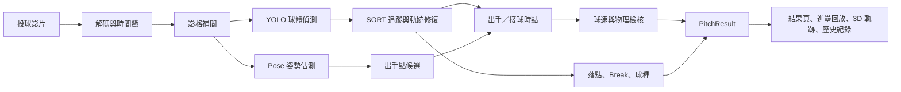

# SpeedGun — iOS 棒球投球分析

SpeedGun 是一款全程在 iPhone 裝置端運行的棒球投球分析 App。系統以 Core ML、AVFoundation 與 Swift 分析投球影片，再由 Expo React Native 呈現球速、球種、好球帶落點、位移量與進壘軌跡。

目前專案只提供 iOS App；影片與分析結果不需要上傳伺服器。

## 功能

### 投球分析

| 功能 | 說明 |
|------|------|
| 棒球偵測 | 使用 Core ML YOLO 逐幀辨識棒球位置 |
| 姿勢估測 | 輔助判斷投手、出手點與投球階段 |
| 物件追蹤 | 使用 SORT 串接偵測點並排除不合理候選 |
| 低幀率補間 | 對 30／60 FPS 影片提高分析密度，改善快速位移追蹤 |
| 軌跡修復 | 補齊漏偵區段並平滑顯示軌跡，同時保留實測與估算標記 |
| 球速計算 | 依手動量測距離、原始影片時間戳、出手／接球時點與 TTC 交叉驗證計算 |
| 球種辨識 | 綜合球速、位移與軌跡特徵判斷直球、曲球、滑球及變速球 |
| 位移量 | 計算水平位移、垂直位移、Induced Vertical Break 與總位移 |
| MLB ABS 好球帶 | 依打者身高建立好球帶，支援 2D／3D 外部校正資料 |
| 分析品質 | 顯示偵測覆蓋率、實測點比例、落點信心與位移信心 |

### 視覺化與回放

| 功能 | 說明 |
|------|------|
| MLB ABS 進壘動畫 | 依實測／補點軌跡播放球路，鏡頭貼近好球帶旋轉並停在投手面向打者的視角 |
| 落點判定 | 球到達終點後固定保留；好球不顯示距離，壞球顯示球體邊緣到好球帶邊緣的距離 |
| 動畫控制 | 支援播放、暫停、慢速與重新播放；軌跡線在鏡頭旋轉完成後隱藏 |
| 3D 進壘軌跡 | 與進壘動畫共用同一份軌跡模型，可旋轉、縮放、切換視角及比較上一球 |
| Break Chart | 以 MLB 風格 X／Y 圖表呈現水平位移與 Induced Vertical Break |
| Overlay 影片 | 在原始影片疊加球路、球速與好球帶資訊 |

### 使用者資料

- 從照片圖庫選取投球影片。
- 在本機保存投球紀錄、設定與分析結果。
- 支援單球詳情、上一球比較與結果分享。
- 分析流程不需要帳號、後端服務或網路連線。

## 架構

### 系統分層

| 層級 | 位置 | 責任 |
|------|------|------|
| UI | `mobile/src/screens`、`mobile/src/components` | 分析操作、結果呈現、動畫、3D 軌跡與歷史紀錄 |
| 應用狀態 | `mobile/src/hooks`、`mobile/src/context` | 分析工作、播放時鐘、相機互動、設定與本機紀錄 |
| 資料轉接 | `mobile/src/adapters/nativeAnalysis.ts` | 將 Swift 原生結果正規化為 App 使用的 `PitchResult` |
| JS／Native Bridge | `mobile/modules/expo-speedgun/src` | 定義 React Native 呼叫原生分析模組的介面 |
| 原生分析核心 | `mobile/modules/expo-speedgun/ios` | 影片解碼、AI 推論、追蹤、球速、球種、落點與 overlay 產生 |
| 裝置能力 | Core ML、AVFoundation、Metal、MediaPipe | 模型推論、影音時間軸、影格補間與姿勢估測 |

### 分析資料流



### 原生分析核心

| 模組 | 責任 |
|------|------|
| `SpeedgunPipeline.swift` | 編排完整分析流程並彙整結果 |
| `VideoDecoder.swift` | 讀取影格、FPS、解析度與原始影片時間戳 |
| `FrameInterpolator.swift`／`FrameInterpolator.metal` | 低 FPS 影片影格補間 |
| `YOLODetector.swift` | Core ML 棒球偵測 |
| `PoseEstimator.swift`／`ReleasePointDetector.swift` | 姿勢估測與出手點候選 |
| `SORTTracker.swift`／`TrajectoryMath.swift` | 軌跡關聯、補點與擬合 |
| `BallSpeedCalculator.swift` | 飛行時間、TTC、距離與球速計算 |
| `PlatePositionEstimator.swift`／`StrikeZoneCalibration.swift` | 本壘板位置、落點與好球帶座標轉換 |
| `BallKinematics.swift`／`PitchClassifier.swift` | 位移量、Break 與球種辨識 |
| `ABSStrikeZoneRenderer.swift`／`OverlayGenerator.swift` | 好球帶與分析影片輸出 |
| `Types.swift` | 原生共用型別、常數與結果資料結構 |

### App 顯示層

| 模組 | 責任 |
|------|------|
| `AnalyzeScreen.tsx` | 影片選取、規格顯示、校正輸入與分析啟動 |
| `ResultScreen.tsx` | 球速、球種、落點、品質、Break 與回放結果 |
| `PitchReplay.tsx` | MLB ABS 風格進壘動畫與邊緣距離標示 |
| `Trajectory3DView.tsx` | 可操作的 3D 球路與上一球比較 |
| `pitchReplay.ts` | 將原生軌跡轉為回放共用的世界座標模型 |
| `trajectoryProjection.ts` | 3D 世界座標、相機與 2D 畫面投影 |
| `HistoryScreen.tsx`／`SessionDetailScreen.tsx` | 本機歷史與單次投球詳情 |
| `SettingsScreen.tsx` | 距離、好球帶、偵測與顯示設定 |

### 架構邊界

- Swift 原生分析核心是球速、落點、Break 與球種的唯一計算來源。
- TypeScript adapter 只負責資料正規化，不重新計算原生分析結果。
- 回放層的補點與平滑只影響動畫呈現，不會回寫或改變球速計算。
- 進壘動畫與 3D 軌跡共用 `PitchReplayModel`，避免同一球產生兩套不同路徑。
- 設定、歷史與影片處理皆保留在裝置端，App 沒有伺服器分析依賴。

### 專案結構

```text
speedgun-mobile/
├── mobile/
│   ├── src/
│   │   ├── screens/                 # App 頁面
│   │   ├── components/              # 分析結果與視覺化元件
│   │   ├── hooks/                   # 分析、歷史、動畫與相機狀態
│   │   ├── context/                 # 設定與結果共享狀態
│   │   ├── adapters/                # 原生結果轉接
│   │   └── utils/                   # 回放模型、投影與格式轉換
│   └── modules/expo-speedgun/
│       ├── src/                     # TypeScript bridge
│       ├── ios/                     # Swift／Metal 原生分析核心
│       └── Resources/               # Core ML 與姿勢模型
├── pitch_classifier/                # 球種分類研究工具
├── src/                             # Python CV／overlay 研究工具
├── scripts/                         # 開發輔助腳本
└── yolov26n/                        # YOLO 訓練資料與研究資產
```
